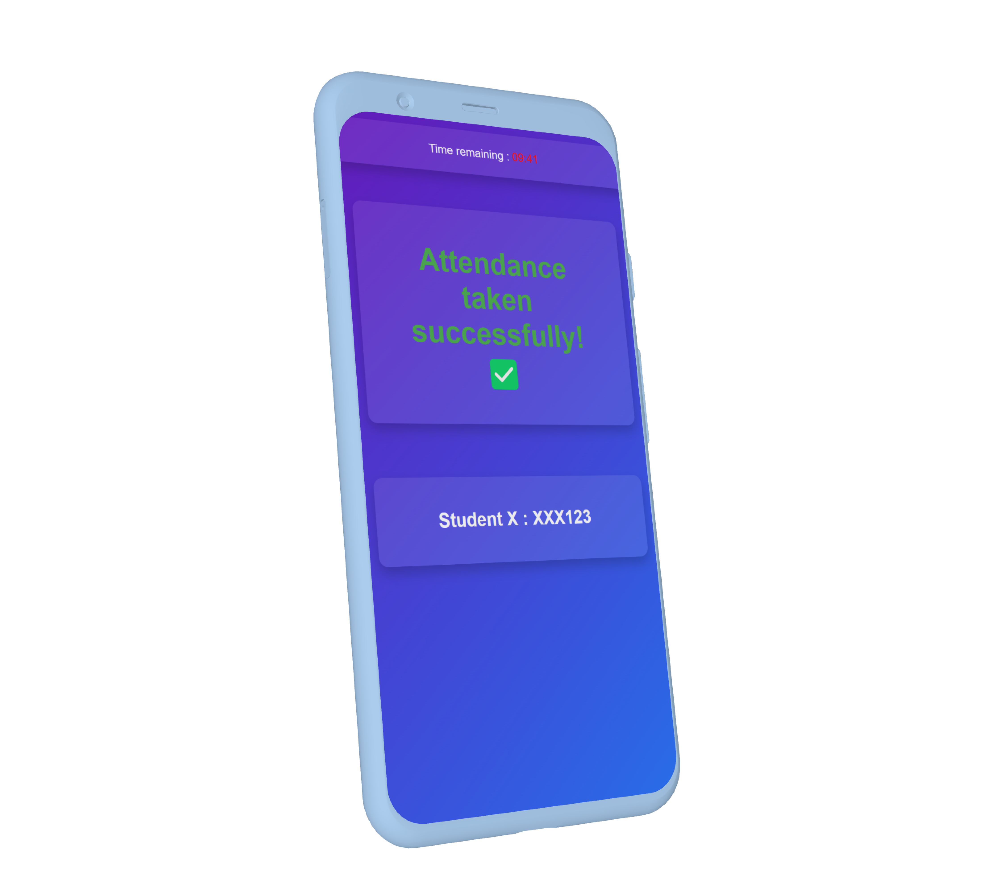
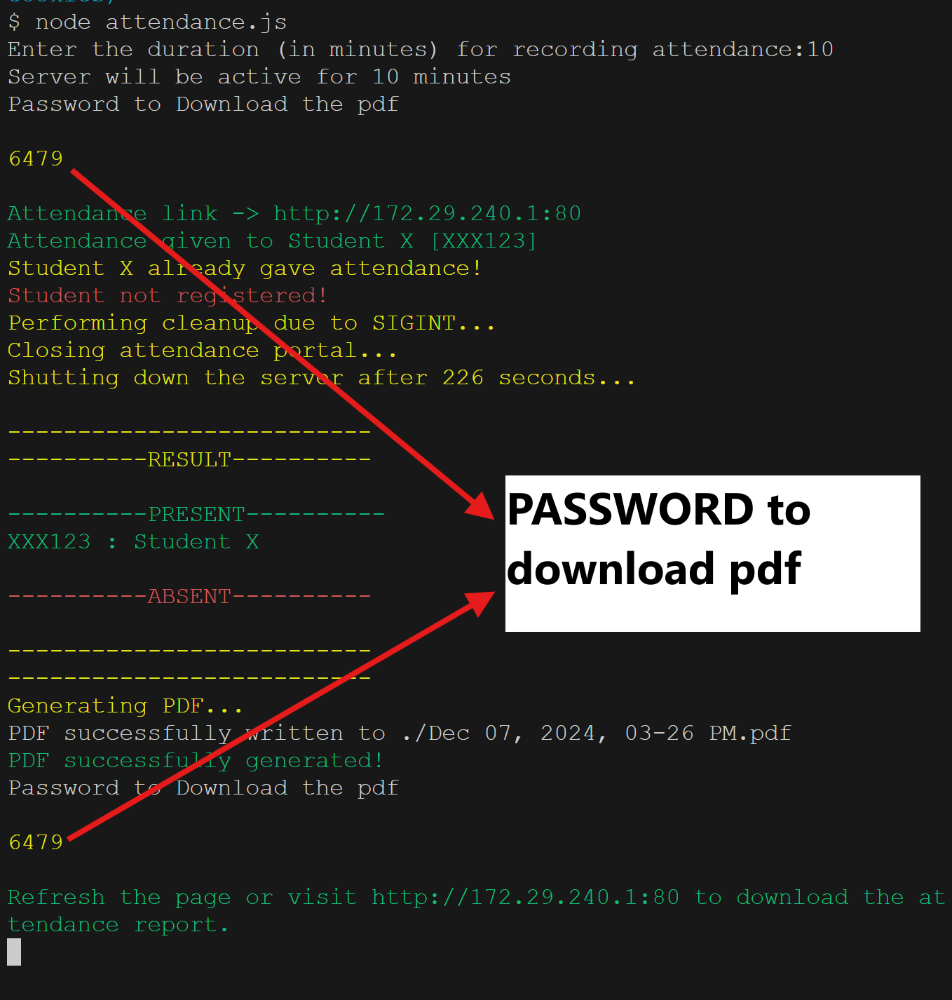
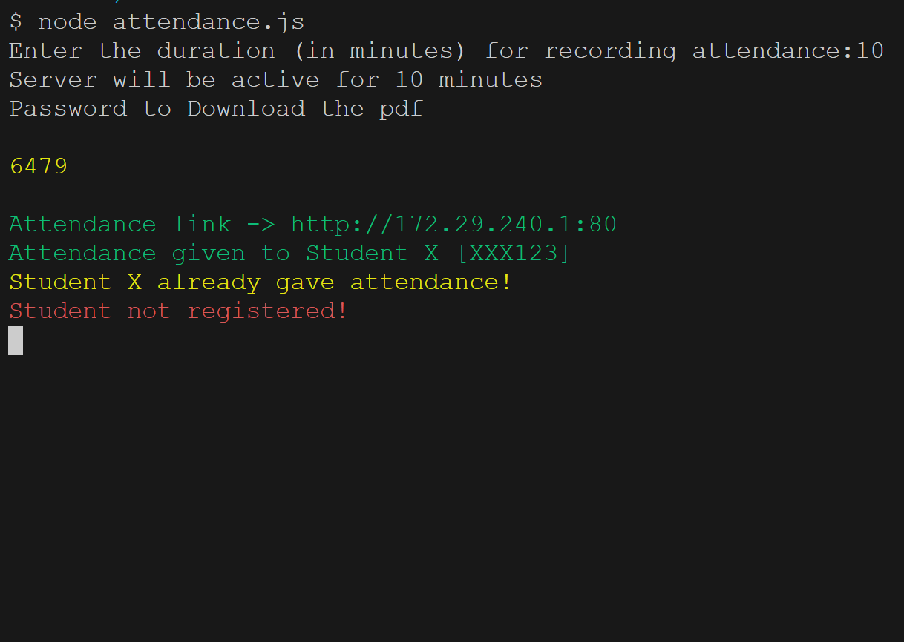
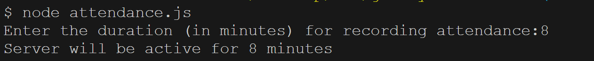
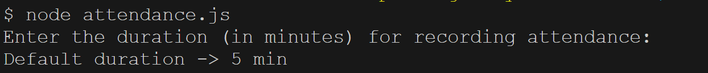
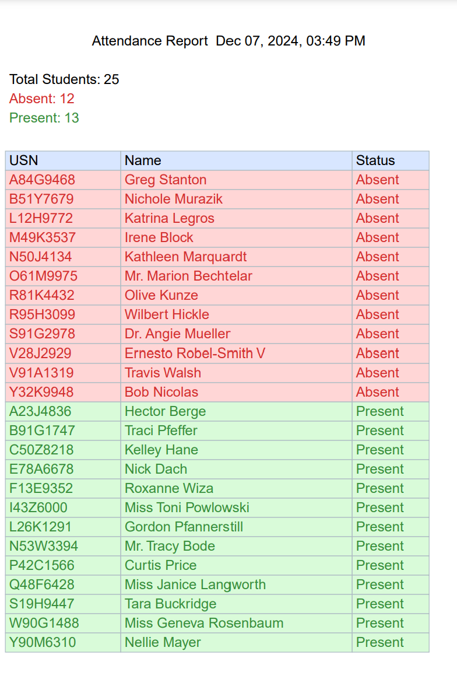
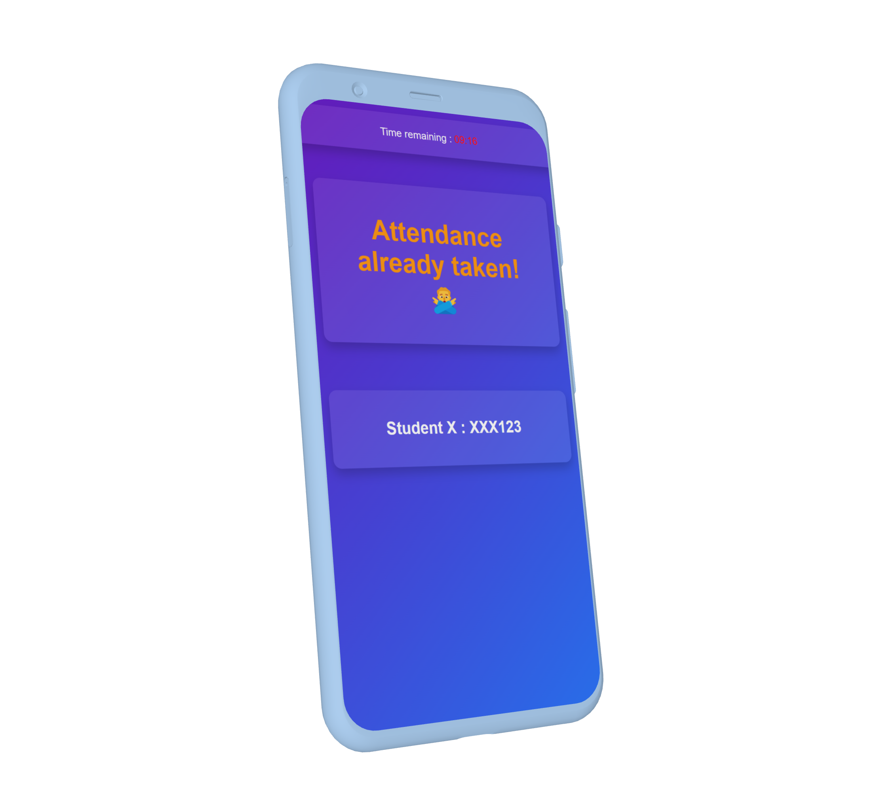
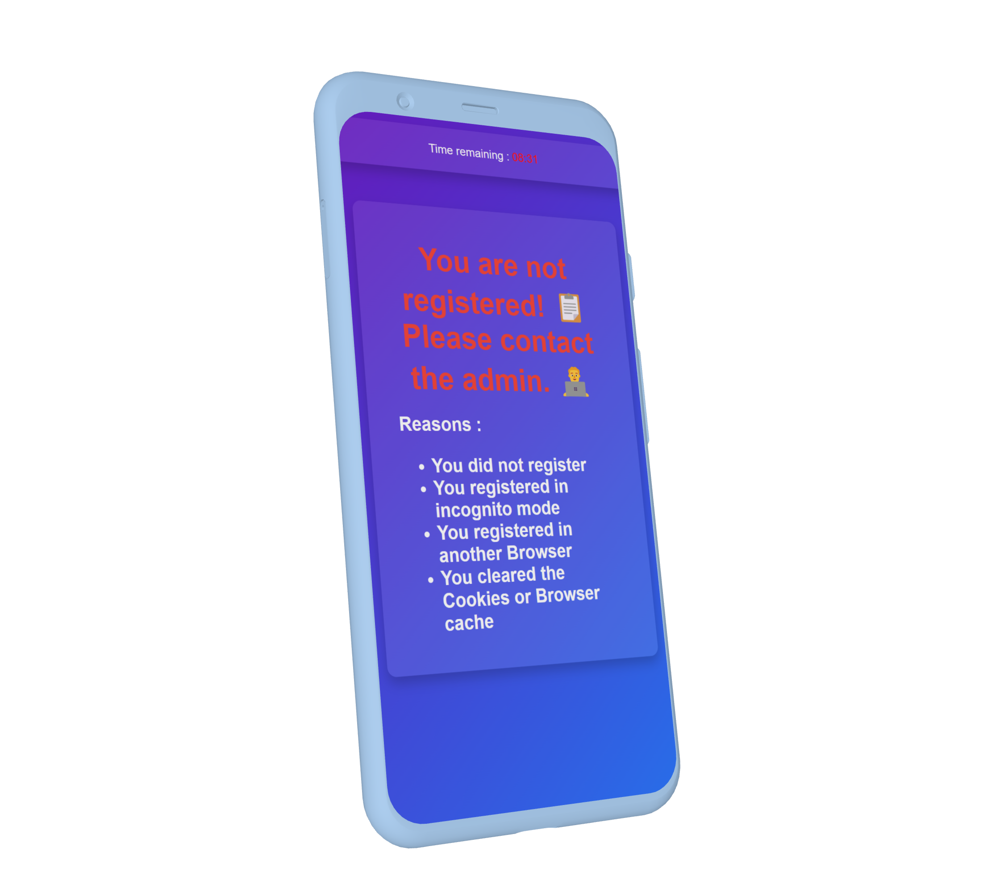
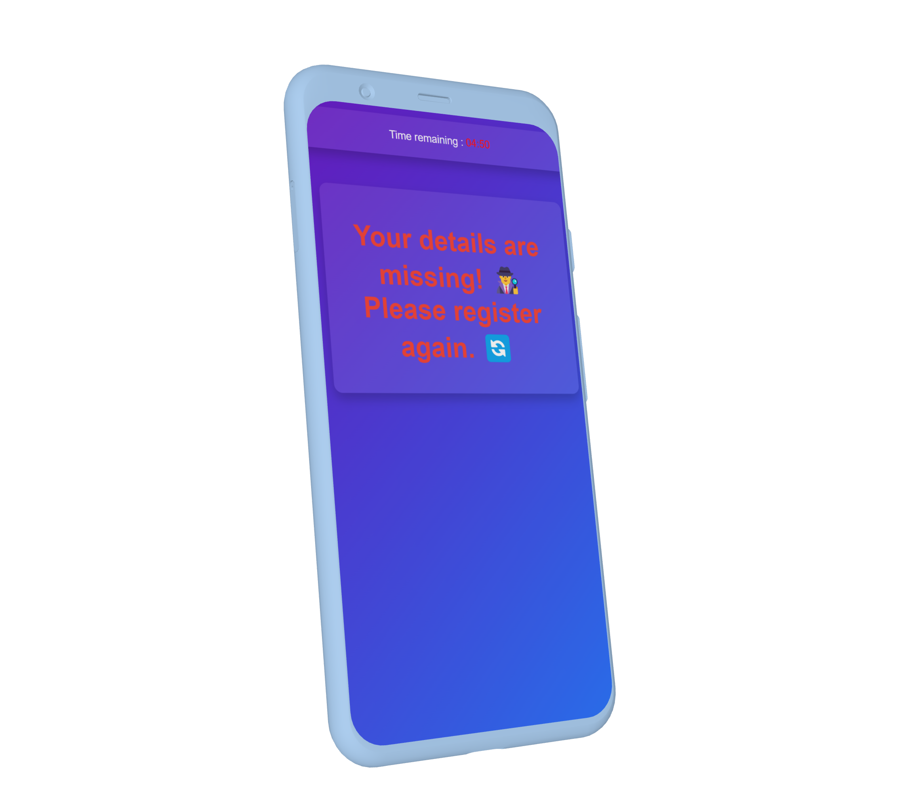

# Get My Attendance  
**A smarter, semi-automated way to manage classroom attendance without the hassle!**  

---

## Table of Contents  
1. [Introduction](#introduction)  
2. [Features](#features)  
3. [Installation](#installation)  
4. [Network Setup Guidelines](#network-setup-guidelines)  
5. [Usage](#usage)  
   - [Registration Phase](#registration-phase)  
   - [Attendance Phase](#attendance-phase)  
6. [PDF Report](#pdf-report)  
7. [Making Life Easier with Shortcuts](#making-life-easier-with-shortcuts)
8. [Testing and Performance](#testing-and-performance)
9. [Troubleshooting Guide](#troubleshooting-guide)  
10. [Edge Case Scenarios](#edge-case-scenarios)  
11. [Mockups & Working Examples](#mockups--working-examples) 
12. [Known Issues & Limitations](#known-issues--limitations)  
13. [Future Plans](#future-plans)  
14. [Contributing](#contributing)  
15. [License](#license)  
16. [Story Behind the Project](#story-behind-the-project)  

---

## Introduction  
Tired of managing attendance manually? **Get My Attendance** is here to save the day!  
With an innovative, browser-based solution, this project lets students register once and automates attendance tracking while ensuring security with cookies.  

> **Curious about the story behind this project?** [Read the full journey here](STORY.md).  

---

## Features  
- **Easy Registration:** Students register just once. 
   

- **Automated Attendance:** Attendance is marked automatically when the link is accessed.
   

- **Secure System:**  
  - Uses cookies to ensure unique identification.  
  - Only the teacher can download attendance with a secure PIN.
   
   - **Secure Pin**:
      

- **Real-Time Updates:** See who has registered, attended, or attempted invalid actions live.  
   

- **Custom Attendance Window:** 
   - At server startup, the host can specify the duration (in minutes) for which the server remains active, allowing students to register or mark their attendance within this time window.
      
   - If no duration is specified, the default time window is set to 5 minutes.
      

- **Flexible Attendance Window:**  
   If all students have successfully marked their attendance before the window closes, the host can manually terminate the attendance window by pressing `Ctrl+C` in the terminal, eliminating the need to wait for the remaining duration.  

- **Downloadable Reports:** Generates attendance details in a sorted, color-coded PDF.
   

- **Failsafe Mechanisms:** Prevents duplicate entries, proxies, and unauthorized access.
   - **Duplicate Registrations:**  
      If a student attempts to register twice, the system will reject the registration and notify both the student and the host.  
      
   - **Duplicate Attendance:**  
      If a student attempts to give attendance twice, the system will reject the attendance and notify both the student and the host.
      
   - **Wrong Password for PDF Download:**
      Students entering an incorrect password will encounter the following error message:
      

- **Performance Optimized:**
   Demonstrates exceptional scalability by efficiently managing 5000 student operations, validated through rigorous stress testing (details in the Testing section).  
---

## Installation  

### For Android Users  
1. **Install Termux**  
   - Download and install [Termux](https://f-droid.org/packages/com.termux/) on your Android device.  

2. **Set Up Git in Termux**  
   Run the following commands to install Git:  
   ```bash  
   pkg update  
   pkg install git  
   ```  

3. **Clone the Repository**  
   ```bash  
   git clone https://github.com/Rai-shwith/get-my-attendance.git  
   cd get-my-attendance  
   git checkout security/cookies  
   ```  

4. **Install Node.js**  
   Run the following commands:  
   ```bash  
   pkg install nodejs  
   ```  

5. **Install Dependencies**  
   ```bash  
   npm install  
   ```  

6. **Set Up the Environment**  
   Create a `.env` file in the root directory and configure the following variables:  
   ```env  
   OUTPUT_FILE_PATH='./'  
   STUDENT_DETAILS_PATH_cookie='attendance/info.json'  
   PORT=1111  # Use 1111 or any other port for Android  
   SECRET_KEY='your-secret-key'  
   ```  

7. **Create a JSON File for Registration**  
   Create a JSON file at the path specified in the `.env` file (e.g., `attendance/info.json`) and initialize it with an empty object:  
   ```json
   {}
   ```
---

## Network Setup Guidelines  

### For the Host  
- **Enable Mobile Hotspot:**  
  Before running the scripts, **turn on your mobile hotspot**. This ensures students can connect to your network for attendance.  

- **Limitations on Android Hotspot:**  
  Android devices generally allow only **10 connections**.  
  - The first **10 students** should connect directly to your hotspot.  
  - For larger classrooms, these 10 students should enable their **own mobile hotspots** to allow others to connect to them in a chain.  

- **Avoid Connecting to Other Wi-Fi Networks:**  
  If the host connects to any external Wi-Fi network (e.g., college Wi-Fi), anyone on that network can access the attendance link.  
  - **For testing purposes:** You can connect to an external Wi-Fi network.  
  - **During attendance:** Ensure the host **only uses their mobile hotspot** for security.  

---

## Usage  

### Registration Phase  
1. **Start the Registration Server**  
   ```bash  
   node register.js  
   ```  

2. **Set the Time Window**  
   Enter the duration (in minutes) for registration or press Enter to use the default (5 minutes).  

3. **Share the Link**  
   Share the link (e.g., `http://192.168.43.1:1111/`) with students.  

4. **Student Registration**  
   - Students connect to the host's hotspot and access the link.  
   - They enter their name and roll number (USN) on the page.  
      
   - The system validates and stores their details securely.  

---

### Attendance Phase  
1. **Start the Attendance Server**  
   ```bash  
   node attendance.js  
   ```  

2. **Set the Time Window**  
   Enter the duration (in minutes) for attendance.  

3. **Secure PIN**  
   Note the 4-digit PIN displayed. It’s required to download the PDF report.  

4. **Share the Link**  
   Share the same link (e.g., `http://192.168.43.1:1111/`) with students. Attendance will be auto-marked upon accessing the page.
     

5. **Download Attendance Report**  
   After the attendance window ends, visit the link to download the PDF by entering the secure PIN.
---

## PDF Report  
The generated PDF includes:  
- Timestamp
- Summary at the beginning
   - Total Students :
   - Absent :
   - Present :
- Sorted attendance details (present and absent).  
- Roll numbers in ascending order.  
- Color-coded entries:  
  - **Green:** Present  
  - **Red:** Absent  
  

> The file is also saved in the specified `OUTPUT_FILE_PATH` and named with the timestamp (e.g., `Dec 06, 2024, 03-04 PM.pdf`).  

---

### Making Life Easier with Shortcuts  
   To simplify the process of running commands like `node attendance.js`, `node register.js`, or `node deleteCookie.js`, you can create aliases in Termux. These shortcuts allow you to replace long commands with simple, memorable ones.  

#### Setting Up Shortcuts in Termux  
1. **Navigate to the Project Root**  
   Ensure you are in the root directory of the project by using:  
   ```bash
   cd /path/to/your/project
   ```

2. **Edit the Bash Configuration File**  
   Open the `.bashrc` file in your Termux environment:  
   ```bash
   nano ~/.bashrc
   ```

3. **Add Aliases for Commands**  
   Add the following lines to create shortcuts:  
   ```bash
   alias atnd_reg='cd /path/to/your/project && node register.js'
   alias atnd='cd /path/to/your/project && node attendance.js'
   alias atnd_delete='cd /path/to/your/project && node deleteCookie.js'
   ```

4. **Save and Apply Changes**  
   Save the file by pressing `Ctrl+O` and then `Ctrl+X`. Apply the changes:  
   ```bash
   source ~/.bashrc
   ```

5. **Use the Shortcuts**  
   Now, instead of typing full commands, you can use:  
   - `atnd` to run the attendance system (`node attendance.js`)  
   - `atnd_reg` to start the registration process (`node register.js`)  
   - `atnd_delete` to execute the delete cookie process (`node deleteCookie.js`)  

#### Benefits  
- Simplifies your workflow.  
- Saves time by reducing the need to type lengthy commands.  
- Keeps your commands consistent and easy to remember.  
---

## Testing and Performance  

Performance tests were conducted to ensure the server’s robustness:  

- **Registration Test:**  
  Registered **5000 random entries asynchronously** using `testRegister.js`. The process completed in **13.9 seconds** without any issues.  

- **Attendance Simulation Test:**  
  Simulated **attendance for 5000 entries simultaneously** using `testAttendance.js`. The server processed all requests in **11.83 seconds**, showing no signs of failure.  

### How to Test  

1. Navigate to the `TESTS/` folder in the project directory.  
2. Use the following scripts to replicate the tests:  
   - **`testRegister.js`:** For testing the registration process.  
   - **`testAttendance.js`:** For testing the attendance simulation.  
Feel free to run these scripts and observe the performance on your system! 
---

## Troubleshooting Guide  
### Common Issues  

1. **Student Clears Cookies/Cache:**  
   
   If a student clears cookies or cache, they won't be able to give attendance, nor can they re-register by running `node register.js` because their information is already present in the host's `STUDENT_DETAILS_PATH_cookie`. Since duplicate roll numbers (USN) aren't allowed, the host must manually delete the student's entry from `STUDENT_DETAILS_PATH_cookie` to allow re-registration.

2. **Student Details Are Lost from `attendance/info.json`:**
   
   If student details are missing, follow these steps:  
   - Clear all cookies by running:  
     ```bash  
     node deleteCookie.js  
     ```  
     
   - After running the script, students should visit the provided link to manually delete the cookie from their browser.  
   - Re-register the students by running:  
     ```bash  
     node register.js  
     ```
     
---


## Edge Case Scenarios  
Here are examples of handled edge cases:  

- **Clearing cookies by accident:** `deleteCookie.js` resolves this. Refer [Troubleshooting Guide](#troubleshooting-guide).


- **Duplicate Registrations:**  
   If a student attempts to register twice, the system will reject the registration and notify both the student and the host.  
   

- **Duplicate Attendance:**  
   If a student attempts to give attendance twice, the system will reject the attendance and notify both the student and the host.
   

- **Student Attempts to Register Others:**  
   If a registered student tries to register another student by accessing the same URL, the registration will be rejected, and notifications will be sent to both the host and the student.
    

- **Attempting Attendance without Prior Registration:**  
   If a student tries to mark attendance without prior registration, the system will reject the attendance attempt.
   

- **Student Trying to Access Attendance PDF**
   If a student attempts to download the attendance PDF, they will need to provide the password known only to the host.   
   - **Wrong Password:**
      Students entering an incorrect password will encounter the following error message:
      
   - **PDF Download Password:**
      The correct password for downloading the PDF will be displayed in the host's console:
      
   - **Correct Password:**
      Upon entering the correct password, the PDF will be successfully downloaded:
      

- **Visiting DeleteCookie webpage**
   - **Missing Student Details:**  
      If a student's details are absent in the `STUDENT_DETAILS_PATH_cookie` file, `deleteCookie.js` will clear the cookie, enabling the student to re-register. Refer to the [Troubleshooting Guide](#troubleshooting-guide) for more information.  
        

   - **Valid Cookie Present:**  
      If the student already has a valid cookie (i.e., their details exist in the `STUDENT_DETAILS_PATH_cookie` file), `deleteCookie.js` will not clear the cookie, ensuring the student does not need to re-register.  
        
---


## Known Issues & Limitations  
- **Cookie Dependency:** Users must use the same browser and avoid incognito mode to retain cookies.  
- **Network Limitation:** Android hotspots allow only 10 direct connections.  
- **Security Risk on Public Wi-Fi:** Ensure the host uses a private mobile hotspot for attendance.  

---

## Future Plans  
- Explore using MAC addresses for unique identification with Raspberry Pi.  
- Implement the `security/canvas` branch for cross-browser compatibility.  
- Optimize scalability for larger classrooms.  

---

## Contributing  
Contributions are welcome! Feel free to fork this repository and submit a pull request.  

---

## License
This project is licensed under the [Creative Commons Attribution-NonCommercial-ShareAlike 4.0 International License](https://creativecommons.org/licenses/by-nc-sa/4.0/).  

You are free to:  
- Share and adapt the work for non-commercial purposes, as long as you provide proper attribution.  
- If you build upon this work, you must distribute your contributions under the same license.  
For commercial use, please contact me at [ashwithrai0404@gmail.com](mailto:ashwithrai0404@gmail.com).
---

## Story Behind the Project  
Want to know how this idea came to life? Read the full backstory and evolution in [STORY.md](STORY.md).  